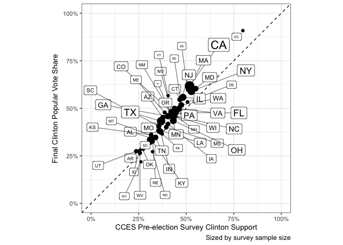

Poll Predictions and Errors
================

This data combines three state-level datasets on the 2016 Presidential Election.

Output
======

The final dataset (`pres16_state.csv`) is a spreadsheet of the 50 states and DC.

``` r
read_csv("data/output/pres16_state.csv")
```

    ## # A tibble: 51 x 35
    ##                   state    st      vap      vep   pct_hrc votes_hrc
    ##                   <chr> <chr>    <int>    <int>     <dbl>     <int>
    ##  1              Alabama    AL  3770142  3601361 0.3435795    729547
    ##  2               Alaska    AK   555367   519849 0.3655087    116454
    ##  3              Arizona    AZ  5331034  4734313 0.4512602   1161167
    ##  4             Arkansas    AR  2286625  2142571 0.3365312    380494
    ##  5           California    CA 30201571 25017408 0.6172640   8753788
    ##  6             Colorado    CO  4305728  3966297 0.4815698   1338870
    ##  7          Connecticut    CT  2821935  2561555 0.5456630    897572
    ##  8             Delaware    DE   749872   689125 0.5335334    235603
    ##  9 District of Columbia    DC   562329   511463 0.9086382    282830
    ## 10              Florida    FL 16565588 14572210 0.4782332   4504975
    ## # ... with 41 more rows, and 29 more variables: tot_votes <int>,
    ## #   cces_hrc <dbl>, cces_n <dbl>, `State Results Website` <chr>,
    ## #   Status <chr>, `VEP Total Ballots Counted` <chr>, `VEP Highest
    ## #   Office` <chr>, `VAP Highest Office` <chr>, `Total Ballots Counted
    ## #   (Estimate)` <dbl>, `Highest Office` <int>, `% Non-citizen` <chr>,
    ## #   Prison <int>, Probation <int>, Parole <int>, `Total Ineligible
    ## #   Felon` <int>, `Overseas Eligible` <chr>, votes_djt <int>,
    ## #   votes_oth <int>, `Clinton %` <chr>, `Trump %` <chr>, `Others %` <chr>,
    ## #   `Dem '12 Margin` <chr>, `Dem '16 Margin` <chr>, `Margin Shift` <chr>,
    ## #   `Total '12 Votes` <int>, `Raw Votes vs. '12` <chr>, cces_djt <dbl>,
    ## #   cces_johnson <dbl>, cces_stein <dbl>

The main columns are

-   `state`: Name of state (full name)
-   `st`: Name of state (abbreviation)
-   `vap`: Estimated Voting Age Population
-   `vep`: Estimated Voting Eligible Population
-   `pct_hrc`: Election Oucome. Hillary Clinton's Vote as a Percentage of Ballots Cast for President
-   `votes_hrc`: Votes for HRC. (Numerator for `pct_hrc`)
-   `tot_votes`: Ballots cast for the Office of President (Denominator for `pct_hrc`)
-   `cces_hrc`: Poll estimated percent of HRC support. See more below.
-   `cces_n`: Sample size for poll.
-   Other columns: unedited and unnamed columns from data sources.

Data Sources
============

The data comes from three sources and is built in `01_readdata.R`

Denominators (VAP, VEP, ..)
---------------------------

The U.S. does not have an official census of citizens or voting *eligible* citizens. Numbers on voter registrants are also out-of-date in some states. Thus the denominator of interest is fairly tricky to compute.

Here we rely on Michael McDonald's estimates at <http://www.electproject.org/>

**Voting Age Population (VAP)** is [defined](http://www.electproject.org/home/voter-turnout/faq/denominator) as folllows:

> The voting-age population, known by the acronym VAP, is defined by the Bureau of the Census as everyone residing in the United States, age 18 and older. Before 1971, the voting-age population was age 21 and older for most states.

**Voting Eligible Population (VEP)** is [defined](http://www.electproject.org/home/voter-turnout/faq/denominator) as follows:

> The voting-eligible population or VEP is a phrase I coined to describe the population that is eligible to vote. Counted among the voting-age population are persons who are ineligible to vote, such as non-citizens, felons (depending on state law), and mentally incapacitated persons. Not counted are persons in the military or civilians living overseas.

I pulled the numbers from his spreadsheet [here](https://docs.google.com/spreadsheets/d/1VAcF0eJ06y_8T4o2gvIL4YcyQy8pxb1zYkgXF76Uu1s/edit#gid=2030096602)

Numerators (Votes, Percentages)
-------------------------------

Vote counts are reported from official election reports and measured exactly. Any final count will do; I used the Cook Political Report's spreadsheet [here](https://docs.google.com/spreadsheets/d/133Eb4qQmOxNvtesw2hdVns073R68EZx4SfCnP4IGQf8)

The column `votes_hrc` refers to the column `Clinton (D)` in the above-linked spreadsheet. `tot_votes` refers to the sum of the three columns `Clinton (D)`, `Trump (R)`, and `Others`.

Poll Prediction
---------------

### CCES

The Cooperative Congressional Election Study (CCES) is one of the largest pre-election studies conducted in the 2016 election. I took estimates from their November 16, 2016 press release [here](https://cces.gov.harvard.edu/news/cces-pre-election-survey-2016). A Google Sheets version of the same table in the release is [here](https://docs.google.com/spreadsheets/d/1pJLEHfvCN-eX1mBfe6sgs0dwF2oq9G1FcUhKFk0Pe8g).

The CCES is conducted online for the several weeks before the election.

The target population is registered voters. Sampling is continuouslly adjusted to obtain a representative sample. Multi-level models and other weighting schemes contribute to final state-level estimates.

Read the press release and guides (e.g. for 2014: [dataverse](https://dataverse.harvard.edu/file.xhtml?fileId=2794577&version=RELEASED&version=.0)) for more details on implementation.

Comparisons
===========

``` r
library(ggplot2)
library(ggrepel)
library(scales)
library(readr)

df <- read_csv("data/output/pres16_state.csv")

ggplot(df, aes(x = cces_hrc, y = pct_hrc, size = cces_n)) +
  geom_point() +
  geom_abline(slope = 1, intercept = 0, linetype = "dashed") +
  geom_label_repel(aes(label = st), segment.alpha = 0.5) +
  scale_x_continuous(limits = c(0, 1), label = percent) +
  scale_y_continuous(limits = c(0, 1), label = percent) +
  guides(size = FALSE) +
  coord_equal() +
  theme_bw() +
  labs(x = "CCES Pre-election Survey Clinton Support",
       y = "Final Clinton Popular Vote Share",
       caption = "Sized by survey sample size")
```



References
==========

-   McDonald, Michael P. 2017. "2016 November General Election" *United States Elections Project.* Accessed July 23, 2017.
-   CCES. 2016. Press Release. <https://cces.gov.harvard.edu/news/cces-pre-election-survey-2016>
-   Cook Political Report. 2017. <http://cookpolitical.com/story/10174>
