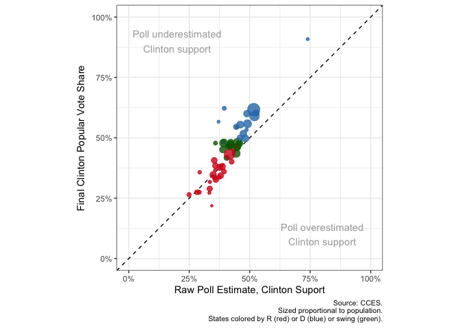
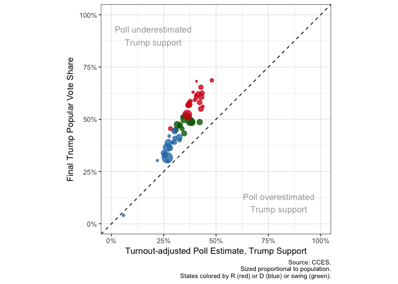

Poll Predictions and Errors
================

This data combines three state-level datasets on the 2016 Presidential Election.

Output
======

The final dataset (`pres16_state.csv`) is a spreadsheet of the 50 states and DC.

``` r
read_csv("data/output/pres16_state.csv")
```

    ## # A tibble: 51 x 30
    ##                   state    st color      vap      vep votes_hrc tot_votes
    ##                   <chr> <chr> <chr>    <int>    <int>     <int>     <int>
    ##  1              Alabama    AL     R  3770142  3601361    729547   2123372
    ##  2               Alaska    AK     R   555367   519849    116454    318608
    ##  3              Arizona    AZ swing  5331034  4734313   1161167   2573165
    ##  4             Arkansas    AR     R  2286625  2142571    380494   1130635
    ##  5           California    CA     D 30201571 25017408   8753788  14181595
    ##  6             Colorado    CO swing  4305728  3966297   1338870   2780220
    ##  7          Connecticut    CT     D  2821935  2561555    897572   1644920
    ##  8             Delaware    DE     D   749872   689125    235603    441590
    ##  9 District of Columbia    DC     D   562329   511463    282830    311268
    ## 10              Florida    FL swing 16565588 14572210   4504975   9420039
    ## # ... with 41 more rows, and 23 more variables: pct_hrc_vep <dbl>,
    ## #   pct_hrc_voters <dbl>, pct_djt_vep <dbl>, pct_djt_voters <dbl>,
    ## #   cces_n_voters <dbl>, cces_n_raw <int>, cces_tothrc_adj_trn <dbl>,
    ## #   cces_tothrc_raw <int>, cces_pct_hrc_voters <dbl>,
    ## #   cces_pct_hrc_vep <dbl>, cces_pct_hrc_raw <dbl>,
    ## #   cces_pct_djt_voters <dbl>, cces_pct_djt_vep <dbl>,
    ## #   cces_pct_djt_raw <dbl>, cv_turnout_wgt <dbl>, yougov_pct_hrc <dbl>,
    ## #   yougov_pct_djt <dbl>, yougov_n <dbl>, `State Results Website` <chr>,
    ## #   rho_hrc_vot <dbl>, rho_hrc_vep <dbl>, rho_djt_vot <dbl>,
    ## #   rho_djt_vep <dbl>

The main columns are

Identifiers

-   `state`: Name of state (full name)
-   `st`: Name of state (abbreviation)
-   `color`: Outcome of the Race as defined by Cook Political: `R` (Republican), `D` (Democrat), `swing` (swing -- see details below.)

Outcomes (including estimates of VAP/VEP)

-   `vap`: Estimated Voting Age Population (see below for definition)
-   `vep`: Estimated Voting Eligible Population (see below for definition)
-   `votes_hrc`: Votes for Clinton
-   `votes_djt`: Votes for Trump
-   `tot_votes`: Ballots cast for the Office of President.
-   `pct_hrc_voters`: Election Outcome. Hillary Clinton's Vote as a Percentage of Ballots Cast for President. Computed by `votes_hrc / tot_votes`
-   `pct_djt_voters`: Same but with Trump
-   `pct_hrc_vep`: Hillary Clinton's Vote as a Percentage of Ballots (estimated) eligible population. Computed by `votes_hrc / vep`
-   `pct_djt_vep`: Same but with Trump

Poll estimates. Construction detailed below and in `03_tabulate_polls.R`

-   `cces_n_voters`: CCES sample size adjusted for estimated turnout propensity
-   `cces_n_raw`: CCES raw number of respondents, or unadjusted proxy estimate of eligible population
-   `cces_tothrc_adj_trn`: CCES estimated Clinton votes
-   `cces_tothrc_raw`: CCES unadjusted total Clinton votes
-   `cces_pct_hrc_voters`: CCES estimated percent of Clinton votes among voters adjusting for turnout (`cces_tothrc_adj_trn/ cces_n_voters`)
-   `cces_pct_hrc_vep`: CCES estimated percent of Clinton votes among voting eligible population (`cces_tothrc_adj_trn / cces_n_raw`)
-   `cces_pct_hrc_raw`: CCES estimated percent of Clinton votes without any adjustment (`cces_tothrc_raw/ cces_n_raw`)
-   `cces_*djt*`: All same as above but with Trump
-   `cv_turnout_wgt` is the coefficient of variation on weights for each state. It is a statistic from `turnout_wgt` in `data/input/cces2016_slim.Rds`. This is used as an adjustment when calculating our parameter estimate.

-   `yougov_pct_hrc`: YouGov estimated of Clinton votes among voters
-   `yougov_pct_djt`: Same but with Trump
-   `yougov_n`: YouGov poll sample size

Parameter Estimates

-   `rho_hrc_vot`: The *ρ* parameter with Clinton support as the quantity of interest and *voters* as the target population
-   `rho_hrc_vep`: The *ρ* parameter with Clinton support as the quantity of interest and *eligible population* as the target population
-   `rho_hrc_vot`: The *ρ* parameter with Trump support as the quantity of interest and *voters* as the target population
-   `rho_hrc_vep`: The *ρ* parameter with Trump support as the quantity of interest and *eligible population* as the target population

Data Sources
============

The data comes from three sources and is built in `01_read_data.R`

Observed Values
---------------

First, the sample space. The U.S. does not have an official census of citizens or voting *eligible* citizens. Numbers on voter registrants are also out-of-date in some states. Thus the denominator of interest is fairly tricky to compute.

Here we rely on Michael McDonald's estimates at <http://www.electproject.org/>

**Voting Age Population (VAP)** is [defined](http://www.electproject.org/home/voter-turnout/faq/denominator) as follows:

> The voting-age population, known by the acronym VAP, is defined by the Bureau of the Census as everyone residing in the United States, age 18 and older. Before 1971, the voting-age population was age 21 and older for most states.

**Voting Eligible Population (VEP)** is [defined](http://www.electproject.org/home/voter-turnout/faq/denominator) as follows:

> The voting-eligible population or VEP is a phrase I coined to describe the population that is eligible to vote. Counted among the voting-age population are persons who are ineligible to vote, such as non-citizens, felons (depending on state law), and mentally incapacitated persons. Not counted are persons in the military or civilians living overseas.

I pulled the VAP and VEP numbers from his spreadsheet [here](https://docs.google.com/spreadsheets/d/1VAcF0eJ06y_8T4o2gvIL4YcyQy8pxb1zYkgXF76Uu1s/edit#gid=2030096602).

Next, the observed election outcome. Vote counts are reported from official election reports and measured exactly. Any final count will do; I used the Cook Political Report's spreadsheet [here](https://docs.google.com/spreadsheets/d/133Eb4qQmOxNvtesw2hdVns073R68EZx4SfCnP4IGQf8).

The column `votes_hrc` refers to the column `Clinton (D)` in the above-linked spreadsheet. `tot_votes` refers to the sum of the three columns `Clinton (D)`, `Trump (R)`, and `Others`.

`color` is taken from the Color of this Cook Political's table and their classification of Swing. "Swing state" is defined as states in which:

> "Swing State" defined as state that flipped from '12 or was decided by less than 5%.

`R` and `D` are non-swing states defined by the presidential winner.

Poll Prediction
===============

**CCES**

The Cooperative Congressional Election Study (CCES) is one of the largest pre-election studies conducted in the 2016 election. The CCES is conducted online for the several weeks before the election.

The target population is registered voters. Sampling is continuously adjusted to obtain a representative sample. Multi-level models and other weighting schemes contribute to final state-level estimates.

I estimated state-level predictions without adjusting for sampling or any other covariate adjustment weights.

I did estimate voters and adjust for estimated turnout in variables `pct_hrc_voters` and `cces_n_voters`. These give a rough proxy for turnout by the coarse weights from the vote intent question. The weights are as specified in the CCES press release:

> \[A weight of\] 1 for those who have already voted, 0.9 for those "definitely voting", 0.3 for those "probably voting", and 0.1 for those not sure).

I coded other responses (No, Skipped, Missing).. to 0.

The code is in `03_tabulate_polls.R`,

``` r
tab_cc <- cc_raw %>% 
  group_by(state) %>% 
  summarize(cces_n_raw = n(),
            cces_n_voters = sum(turnout_wgt, na.rm = TRUE),
            cces_tothrc_raw = sum(vote_hrc, na.rm = TRUE),
            cces_tothrc_adj_trn = sum(vote_hrc*turnout_wgt, na.rm = TRUE),
            cces_totdjt_raw = sum(vote_djt, na.rm = TRUE),
            cces_totdjt_adj_trn = sum(vote_djt*turnout_wgt, na.rm = TRUE),
            sd_turnout_wgt = sqrt(sum((turnout_wgt - mean(turnout_wgt))^2)/n()),
            cv_turnout_wgt = sd_turnout_wgt / mean(turnout_wgt)) %>%
  mutate(cces_pct_hrc_raw = cces_tothrc_raw / cces_n_raw,
         cces_pct_hrc_vep = cces_tothrc_adj_trn / cces_n_raw,
         cces_pct_hrc_voters = cces_tothrc_adj_trn / cces_n_voters,
         cces_pct_djt_raw = cces_totdjt_raw / cces_n_raw,
         cces_pct_djt_vep = cces_totdjt_adj_trn / cces_n_raw,
         cces_pct_djt_voters = cces_totdjt_adj_trn / cces_n_voters)
```

**YouGov Release**

YouGov runs the CCES survey and generates their estimates with their algorithm. I took estimates from their November 16, 2016 press release [here](https://cces.gov.harvard.edu/news/cces-pre-election-survey-2016). A Google Sheets version of the same table in the release is [here](https://docs.google.com/spreadsheets/d/1pJLEHfvCN-eX1mBfe6sgs0dwF2oq9G1FcUhKFk0Pe8g).

Read the press release and guides (e.g. for 2014: [dataverse](https://dataverse.harvard.edu/file.xhtml?fileId=2794577&version=RELEASED&version=.0)) for more details on implementation.

Poll Estimates
==============

Estimating Clinton Support
--------------------------

``` r
gg_hrc + aes(x = cces_pct_hrc_voters) +
  xlab("Turnout-adjusted Poll Estimate, Clinton Support")
```



``` r
gg_hrc + aes(x = cces_pct_hrc_raw) +
  xlab("Raw Poll Estimate, Clinton Suport")
```


Estimating Trump Support
------------------------

``` r
gg_djt + aes(x = cces_pct_djt_voters) +
  xlab("Turnout-adjusted Poll Estimate, Trump Support")
```



``` r
gg_djt + aes(x = cces_pct_djt_raw) +
  xlab("Raw Poll Estimate, Trump Suport")
```


Estimates of *ρ*
================

We use this function for the columns `rho_*`. Input is defined in terms of its sampling target (actual votes vs. vep). We use the CCES estimates for now.

``` r
rho_estimate <- function(data = df, N, mu, muhat, n, cv = NULL) {
  
  
  N <- data[[N]]
  n <- data[[n]]
  mu <- data[[mu]]
  muhat <- data[[muhat]]
  if (!is.null(cv)) cv <- data[[cv]]
  
  ## parts
  one_over_sqrtN <- 1 / sqrt(N)
  diff_mu <- muhat - mu
  f <- n / N
  one_minus_f <- 1 - f
  s2hat <- mu * (1 - mu)
  if (!is.null(cv)) {
    A <- sqrt(1 + (cv^2 / one_minus_f))
    one_over_A <- 1 /A
  }

  
  ## estimate of rho
  if (!is.null(cv))
    return(one_over_A* one_over_sqrtN * diff_mu / sqrt((one_minus_f / n) * s2hat))
  
  if (is.null(cv))
     return(one_over_sqrtN * diff_mu / sqrt((one_minus_f / n) * s2hat))
}
```

We present two versions of this estimate based on the sampling

Based on voters
---------------

For *ρ*<sub>*H**R**C*, *v**o**t**e**r*</sub>, we use

``` r
df$rho_vot <- rho_estimate(N = "tot_votes",
                           mu = "pct_hrc_voters",
                           muhat = "cces_pct_hrc_voters",
                           n = "cces_n_voters",
                           cv = "cv_turnout_wgt")
```

Based on voting eligible population
-----------------------------------

For *ρ*<sub>*H**R**C*, *v**e**p*</sub>, we use

``` r
df$rho_vep <- rho_estimate(N = "vep",
                           mu = "pct_hrc_voters",
                           muhat = "cces_pct_hrc_raw",
                           n = "cces_n_raw")
```

I did the same for Trump voters ( *ρ*<sub>*D**J**T*, *v**o**t**e**r*</sub>, *ρ*<sub>*D**J**T*, *v**o**t**e**r*</sub>), where all estimates of Clinton were replaced with their Trump equivalents.

Figures as PDFs are in `figures`.

References
==========

-   McDonald, Michael P. 2017. "2016 November General Election" *United States Elections Project.* Accessed July 23, 2017.
-   CCES. 2016. Press Release. <https://cces.gov.harvard.edu/news/cces-pre-election-survey-2016>
-   Cook Political Report. 2017. <http://cookpolitical.com/story/10174>
